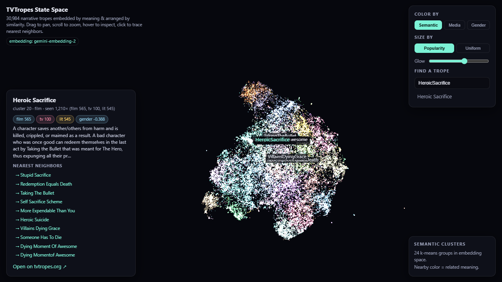

# TVTropes State Space — Gemini Embedding 2

Embed all **30,984 TVTropes** by meaning with **`gemini-embedding-2`**, arrange
them by similarity, and explore the resulting "state space" in an interactive
WebGL demo.

### ▶ Live demo: https://sh1ftmaker.github.io/tvtropes-state-space/



## What it does
- **Data**: a GitHub clone of the [dhruvilgala/tvtropes](https://github.com/dhruvilgala/tvtropes)
  dataset (30K tropes + descriptions, 1.9M occurrences across film / TV / literature).
- **Type signal**: each trope gets a media-mix signature (film/tv/lit counts +
  dominant medium) and a "genderedness" score, used to color the space.
- **Embeddings**: every trope's *name + description* is embedded with Google's
  `gemini-embedding-2` (768-dim, L2-normalized) via **Vertex AI**.
- **Layout**: PCA → UMAP (2D & 3D) for the map, KMeans for 24 semantic clusters,
  and an exact k-nearest-neighbor graph in the full embedding space.
- **Demo**: two linked single-file WebGL views —
  - **2D map** (`index.html`): pan/zoom + touch over all 30,984 points, color by
    semantic cluster / dominant medium / genderedness, size by popularity,
    full-text search, click-to-trace nearest neighbors.
  - **3D flythrough** (`3d.html`, Three.js): fly (WASD + look) or orbit through the
    cloud, render the full neighbor web, and **remap the X/Y/Z axes to any metric**
    (semantic UMAP axes, film/tv/lit share, popularity, genderedness, cluster) to
    smoothly regroup the tropes — set Z=flat for a 2D arrangement to compare.

## Pipeline
```
data/full/TVTropesData/*.csv          # extracted dataset (659MB zip from Google Drive)
        │  build_features.py
        ▼
out/trope_features.parquet            # 30,984 rows: text + media mix + genderedness
        │  embed_gemini.py  (gemini-embedding-2, Vertex AI, 24 workers, resumable)
        ▼
out/embeddings_gemini.npz             # (30984, 768) float32, L2-normalized
        │  project.py  (PCA→UMAP 2D/3D + KMeans + kNN)
        ▼
out/points.json                       # everything the demo needs
        │  index.html  (WebGL)
        ▼
http://localhost:8731                 # interactive state space
```

## Reproduce
```bash
# 1. data
python src/build_features.py --data data --out out/trope_features.parquet

# 2. embeddings — Vertex AI service account (gemini-embedding-2 lives in `global`)
python src/embed_gemini.py --in out/trope_features.parquet \
    --out out/embeddings_gemini.npz --sa sa.json --location global \
    --model gemini-embedding-2 --dim 768 --workers 24
#   (or AI-Studio API key:  set GEMINI_API_KEY  and drop --sa/--location)

# 3. projection
python src/project.py --emb out/embeddings_gemini.npz \
    --feat out/trope_features.parquet --out out

# 4. view
cd out && python -m http.server 8731    # open http://localhost:8731
```

## Notes
- `gemini-embedding-2` processes **one input per request**; the embedder fans
  out single calls across a thread pool and caches each vector to
  `out/embeddings_gemini_cache/` so any rerun resumes instantly.
- On Vertex AI the model is only published in the **`global`** location for this
  project; `us-central1` etc. return 404 (use `gemini-embedding-001` there).
- `embed_local.py` is a TF-IDF+SVD placeholder embedder with the same output
  format — handy for validating the viz without API access.
- **Secrets**: `sa.json` and `secret.key` are credentials — keep them out of any
  commit / share.

## Semantic sanity checks (gemini-embedding-2 nearest neighbors)
- **ChekhovsGun** → Chekhovs Armory / Gag / Skill / Gunman / News / Army / Boomerang
- **HeroicSacrifice** → Taking The Bullet, Redemption Equals Death, Someone Has To
  Die, Dying Moment Of Awesome  *(near-zero lexical overlap — pure meaning)*
